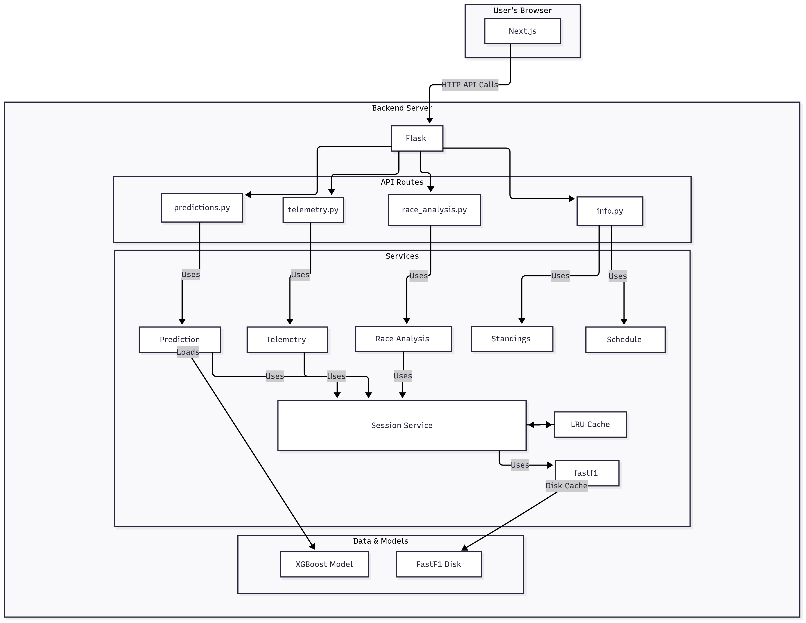
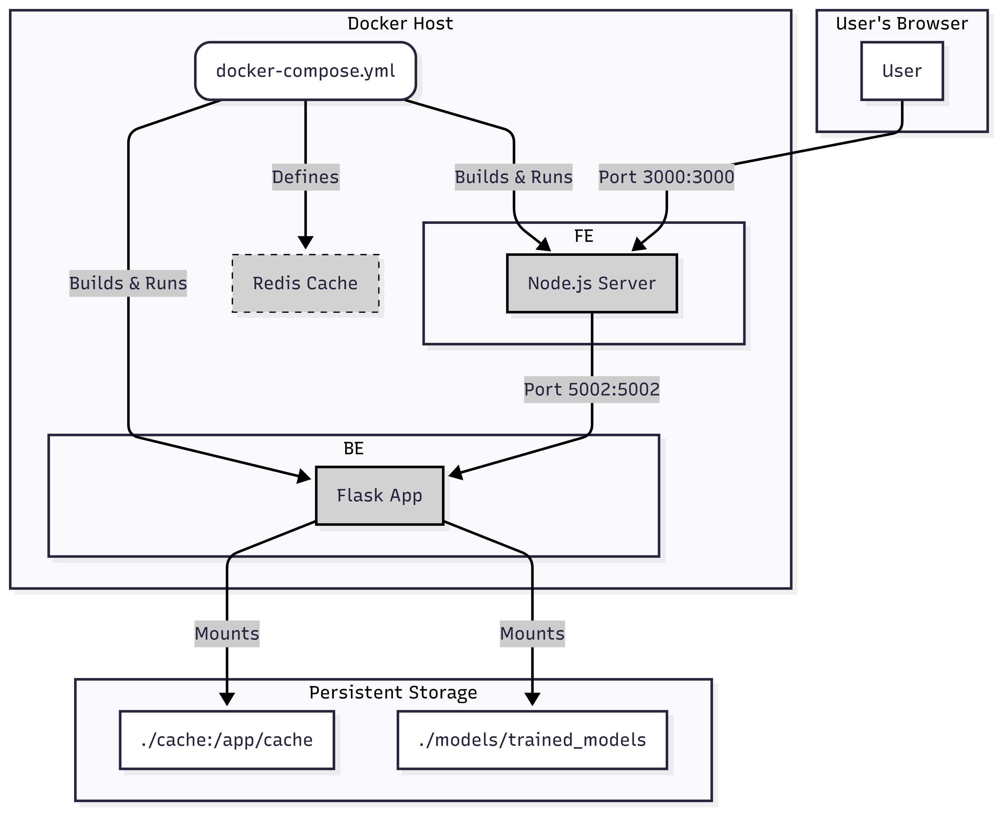

# F1 Data Visualization & Prediction

This is a web application for visualizing, analyzing, and predicting Formula 1 data.

## Overview

I built this web application to provide interactive visualizations and analysis of Formula 1 data, including telemetry, race analysis, and information about drivers, teams, and schedules. It now includes a machine learning feature to predict qualifying lap times.

## Features

- **Qualifying Time Prediction**: Predicts qualifying lap times based on practice session data using an XGBoost machine learning model.
- **Telemetry Visualization**: Compare speed traces, gear shifts, and track dominance between drivers.
- **Race Analysis**: Analyze race pace, team pace, and lap sections.
- **Information**: View driver standings, constructor standings, and race schedules.

## Architecture

### Application Architecture



### Deployment Architecture



## Project Structure

```
f1-web-app/
├── api/                  # Flask API
│   ├── routes/           # API endpoints
│   └── utils/            # API utilities
├── f1w-frontend/         # Next.js frontend
│   ├── app/              # Next.js app directory
│   │   ├── components/   # Reusable UI components
│   │   └── utils/        # Utility functions
│   └── ...               # Page components
├── data/                 # Data files
├── docs/                 # Documentation
│   └── images/           # Architecture diagrams
├── models/               # Shared domain models and trained ML models
├── scripts/              # Utility scripts
├── services/             # Data processing and ML services
└── utils/                # Shared utilities
```

## Getting Started

### Prerequisites

- Python 3.8+
- Node.js 14+
- Docker and Docker Compose
- pip
- npm or yarn

### Installation

1.  **Clone the repository:**
    ```bash
    git clone https://github.com/your-username/f1-web-app.git
    cd f1-web-app
    ```

2.  **Backend Setup (for local development):**
    -   Navigate to the `f1webapp` directory.
    -   Create and activate a virtual environment:
        ```bash
        python -m venv .venv
        source .venv/bin/activate
        ```
    -   Install Python dependencies:
        ```bash
        pip install -r requirements.txt
        ```

3.  **Frontend Setup (for local development):**
    -   Navigate to the `f1w-frontend` directory:
        ```bash
        cd f1w-frontend
        ```
    -   Install Node.js dependencies:
        ```bash
        npm install
        ```

### Running with Docker (Recommended)

1.  **Navigate to the `f1webapp` directory:**
    ```bash
    cd f1webapp
    ```
2.  **Build and run the application:**
    ```bash
    docker-compose up --build
    ```
    - The frontend will be available at `http://localhost:3000`.
    - The backend will be available at `http://localhost:5002`.

### Running Locally

1.  **Start the Backend:**
    -   From the `f1webapp` directory, run:
        ```bash
        python run.py
        ```
    -   The Flask server will start on `http://localhost:5002`.

2.  **Start the Frontend:**
    -   In a new terminal, navigate to the `f1w-frontend` directory:
        ```bash
        cd f1w-frontend
        ```
    -   Start the Next.js development server:
        ```bash
        npm run dev
        ```
    -   The frontend will be available at `http://localhost:3000`.

## Acknowledgments

- [FastF1](https://github.com/theOehrly/Fast-F1)
- [Flask](https://flask.palletsprojects.com/)
- [Next.js](https://nextjs.org/)
- [Tailwind CSS](https://tailwindcss.com/)
- [Chart.js](https://www.chartjs.org/)
- [D3.js](https://d3js.org/)
- [XGBoost](https://xgboost.ai/)
